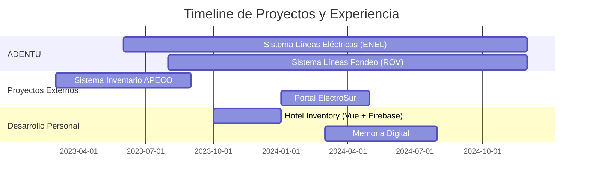

<div align="center">

<!-- HEADER CON DISEÑO MINIMALISTA -->


</div>

<!-- TYPING ANIMATION -->
<p align="center">
  
</p>

<!-- WAVE SEPARATOR -->


<!-- LAYOUT PRINCIPAL CON DISEÑO GRID -->
<table width="100%">
<tr>
<td width="35%" valign="top">


### 🎯 SOBRE MÍ

```typescript
const developer = {
    nombre: "Tomás Andrade Pérez",
    rol: "Ingeniero en Informática",
    ubicación: "Puerto Montt 🇨🇱",
    
    especialización: [
        "Full Stack Development",
        "Cloud Architecture",
        "Database Design",
        "UI/UX Engineering",
        "IoT & Embedded Systems"
    ],
    
    experiencia: {
        proyectosReales: 6,
        empresasClientes: 3,
        sectores: ["Energía", "Acuicultura", 
                   "Hotelería", "Servicios"]
    },
    
    mentalidad: {
        aprendizaje: "continuo",
        enfoque: "soluciones reales",
        calidad: "siempre primero"
    }
};
```

<br>

### 📍 CONTACTO

```yaml
📧 toomas.andrade09@gmail.com
📱 +56 9 9992 5688
🆔 21.121.656-5
📍 Puerto Montt, Chile
🌐 Disponibilidad: Inmediata
💼 Modalidad: Todas
```

<br>

### 🎓 FORMACIÓN

**Ingeniería en Informática**  
📚 Instituto Profesional Santo Tomás  
⏳ En curso - Último año

**Técnico en Electricidad**  
🔧 Instituto del Mar C. Williams  
✅ Titulado

</td>
<td width="65%" valign="top">

<!-- SECCIÓN DE ESTADÍSTICAS CON DISEÑO MODERNO -->
### 📊 MÉTRICAS DE DESARROLLO

<p align="center">
  
  
</p>

<p align="center">
  
</p>

<p align="center">
  
</p>

</td>
</tr>
</table>

<!-- SEPARATOR -->


<!-- TECH STACK CON DISEÑO ICONOGRÁFICO -->
<h2 align="center">⚡ ARSENAL TECNOLÓGICO</h2>

<p align="center">
  
</p>

<details>
<summary><b>🔍 Ver Stack Completo Detallado</b></summary>

<br>

<table width="100%">
<tr>
<td width="25%">

**Frontend**
```
→ HTML5
→ CSS3
→ JavaScript
→ Vue.js
→ React
→ SASS
→ Tailwind CSS
```

</td>
<td width="25%">

**Backend**
```
→ Python
→ PHP 8
→ Java
→ C++
→ C#
→ .NET
→ Django
```

</td>
<td width="25%">

**Database**
```
→ MySQL 8
→ SQL Server
→ Firebase
→ AWS S3
→ Database Design
→ Query Optimization
```

</td>
<td width="25%">

**DevOps & Cloud**
```
→ Microsoft Azure
→ Firebase
→ AWS S3
→ Git/GitHub
→ REST APIs
→ Railway
```

</td>
</tr>
<tr>
<td width="25%">

**Frameworks**
```
→ Laravel
→ Django
→ Bootstrap
→ Tailwind CSS
```

</td>
<td width="25%">

**Tools**
```
→ VS Code
→ PyCharm
→ Android Studio
→ Jira
→ MySQL Workbench
```

</td>
<td width="25%">

**Design**
```
→ Figma
→ Adobe XD
→ AutoCAD
→ UI/UX
→ Prototyping
```

</td>
<td width="25%">

**Otros**
```
→ Arduino
→ Cisco Packet
→ Excel Avanzado
→ Inglés Intermedio
→ Patrones de Diseño
```

</td>
</tr>
</table>

</details>

<!-- SEPARATOR -->


<!-- PORTAFOLIO DE PROYECTOS CON DISEÑO CARD -->
<h2 align="center">🚀 PORTAFOLIO DE PROYECTOS</h2>

<div align="center">
<table>
<tr>
<td width="50%">

<!-- PROYECTO 1 -->
<div align="center">
  
### ⚡ Sistema de Inspección Líneas Eléctricas
**ADENTU - ENEL** • `Producción Multi-Cliente`

</div>

```yaml
Tipo: Infraestructura Crítica
Sector: Energía Eléctrica
Cliente: ENEL Chile
Estado: ✅ Activo en Producción
```

**Stack:**  


**Descripción:**  
Sistema avanzado para gestión de inspecciones de líneas de transmisión eléctrica mediante drones. Utilizado actualmente por ENEL para el monitoreo de más de 5,000 MW de capacidad eléctrica y +5,000 km de líneas.

**Highlights:**
- 🚁 Integración con inspecciones por drones
- 🗺️ Mapeo georreferenciado con Leaflet
- 📊 Dashboard con análisis de criticidad
- 📸 Gestión masiva de imágenes HD
- 🎯 Priorización automática de hallazgos
- 📈 Reportes técnicos automatizados
- 🔴 Mapas de criticidad por riesgo
- ⚡ Detección de fallas incipientes

**Funcionalidades Clave:**
```
→ Módulo de levantamientos por torres
→ Gestión de hallazgos críticos
→ Mediciones técnicas detalladas
→ Exportación PDF/Excel/CSV
→ Sistema de roles y permisos
→ Análisis predictivo de fallas
```

**Impacto:**
```
✅ +5,000 MW de capacidad inspeccionada
✅ +5,000 km de líneas revisadas
✅ Reducción de riesgos operacionales
✅ Cliente: ENEL Chile (empresa líder)
```

**En vivo:**  
🌐 [lineas.adentu.cloud](https://lineas.adentu.cloud/)

</td>
<td width="50%">

<!-- PROYECTO 2 -->
<div align="center">
  
### 🌊 Sistema de Inspección ROV Submarina
**ADENTU Líneas Fondeo** • `SaaS Multi-Empresa`

</div>

```yaml
Tipo: Inspección Submarina
Sector: Acuicultura Marina
Estado: ✅ Multi-Empresa Activo
```

**Stack:**  


**Descripción:**  
Plataforma SaaS especializada para inspecciones submarinas con ROV (vehículos operados remotamente) en centros de cultivo, líneas de fondeo, balsas jaulas y estructuras marítimas.

**Highlights:**
- 🤿 Integración con ROV submarinos
- 📷 Procesamiento masivo de fotos submarinas
- 🎥 Gestión de video HD subacuático
- 📊 Análisis de criticidad por estructura
- 🗂️ Almacenamiento en AWS S3
- 📋 Mediciones técnicas detalladas
- 📈 Gráficos de hallazgos y criticidades
- 📄 Conversión automática de PDFs

**Funcionalidades Técnicas:**
```
→ Sistema multi-tenant (multi-empresa)
→ Gestión de inspecciones por centro
→ Tablas dinámicas tipo Excel
→ Upload masivo de imágenes
→ Clasificación por criticidad
→ Reportes automatizados
→ Historial completo de inspecciones
```

**Impacto:**
```
✅ Múltiples empresas acuícolas del sur
✅ Miles de fotos submarinas procesadas
✅ +10,000 horas de vigilancia subacuática
✅ Estándar en inspecciones ROV
```

**Tecnología Destacada:**
- Almacenamiento escalable en AWS S3
- Procesamiento de imágenes submarinas
- Arquitectura multi-tenant robusta

</td>
</tr>

<tr>
<td width="50%">

<!-- PROYECTO 3 -->
<div align="center">
  
### 🏨 Hotel Inventory System
**Sistema de Gestión Hotelera** • `Proyecto Completo`

</div>

```yaml
Tipo: Sistema de Gestión
Sector: Hotelería & Turismo
Estado: ✅ Funcional
```

**Stack:**  


**Descripción:**  
Sistema completo de gestión de inventario hotelero desarrollado con Vue.js y Firebase. Permite administrar habitaciones, reservas, servicios y control de stock en tiempo real.

**Highlights:**
- 🏨 Gestión integral de habitaciones
- 📦 Control de inventario en tiempo real
- 🔥 Base de datos Firebase Realtime
- 📊 Dashboard con métricas hoteleras
- 🔐 Autenticación de usuarios
- 📱 Interfaz responsive moderna
- ⚡ Actualizaciones en tiempo real
- 📈 Reportes de ocupación

**Módulos Principales:**
```
→ Gestión de habitaciones y tipos
→ Control de reservas
→ Inventario de servicios
→ Panel administrativo
→ Sistema de notificaciones
→ Estadísticas y reportes
```

**Tecnología:**
```
✅ Vue.js 3 (Frontend framework)
✅ Firebase Firestore (Database)
✅ Firebase Authentication
✅ Firebase Hosting
✅ Real-time updates
```

</td>
<td width="50%">

<!-- PROYECTO 4 -->
<div align="center">
  
### ⚡ Portal ElectroSur
**Sistema de Atención al Cliente** • `Proyecto Empresarial`

</div>

```yaml
Tipo: Portal Web Empresarial
Sector: Servicios Eléctricos
Estado: ✅ Prototipo Funcional
```

**Stack:**  


**Descripción:**  
Portal digital para gestión de solicitudes de clientes de ElectroSur Ltda. Transforma el proceso manual de atención mediante una plataforma centralizada y eficiente.

**Problema Resuelto:**
- ❌ Sin sistema digital para solicitudes
- ❌ Gestión manual con pérdida de datos
- ❌ Información dispersa entre equipos
- ✅ Portal unificado de atención

**Highlights:**
- 📝 Registro estructurado de solicitudes
- 🎫 Sistema de tickets automatizado
- 👥 Gestión de usuarios y roles
- 📊 Panel administrativo completo
- 🔔 Notificaciones automáticas
- 📈 Seguimiento de estado en tiempo real
- 🎯 Priorización de requerimientos
- 📋 Reportes de gestión

**Funcionalidades:**
```
→ Formularios de solicitud rápidos
→ Asignación automática a técnicos
→ Panel de administración
→ Historial completo de casos
→ Métricas de eficiencia
→ Exportación de reportes
```

**Impacto:**
```
✅ Eliminación de gestión manual
✅ Centralización de información
✅ Mejora en tiempos de respuesta
✅ Mayor satisfacción del cliente
```

**Tecnología Destacada:**
- Backend robusto con Django
- UI moderna con Tailwind CSS
- Prototipado en Figma

</td>
</tr>

<tr>
<td width="50%">

<!-- PROYECTO 5 -->
<div align="center">
  
### 🕯️ Memoria Digital
**Plataforma de Lápidas Digitales** • `E-commerce + SaaS`

</div>

```yaml
Tipo: Plataforma Digital Memorial
Sector: Servicios Funerarios
Estado: ✅ Sistema Completo
```

**Stack:**  


**Descripción:**  
Sistema innovador para crear lápidas digitales interactivas que permiten mantener viva la memoria de los seres queridos. Integra e-commerce de lápidas físicas con QR.

**Highlights:**
- 🕯️ Creación de memoriales digitales
- 📸 Galería multimedia (fotos/videos)
- 🎵 Reproductor de música conmemorativa
- 💬 Sistema de condolencias
- 🛒 E-commerce de lápidas con QR
- 📱 Lápidas de aluminio con código QR
- 🔗 Acceso mediante QR en ataúdes
- 🌐 Perfiles públicos personalizables

**Funcionalidades Principales:**
```
→ Gestión de perfiles de fallecidos
→ Upload de fotos y videos
→ Biblioteca de música memorial
→ Muro de condolencias interactivo
→ Tienda online de lápidas físicas
→ Sistema de QR único por memorial
→ Administración de familias
```

**Innovación:**
```
✅ Fusión digital + físico
✅ QR en lápidas de aluminio
✅ Multimedia ilimitado
✅ Acceso perpetuo
✅ E-commerce integrado
```

**Impacto Social:**
- Preservación digital de memorias
- Nueva forma de honrar a los difuntos
- Accesibilidad desde cualquier lugar

</td>
<td width="50%">

<!-- PROYECTO 6 -->
<div align="center">
  
### 🏢 Sistema de Gestión de Inventario
**APECO** • `Sistema Empresarial`

</div>

```yaml
Tipo: Sistema de Gestión Empresarial
Sector: Retail Industrial
Estado: ✅ Producción Activa
```

**Stack:**  


**Descripción:**  
Plataforma web integral para gestión completa de inventarios con análisis en tiempo real, control de stock y dashboard ejecutivo para toma de decisiones.

**Highlights:**
- 📦 Gestión completa de inventario
- 📊 Dashboard con KPIs en tiempo real
- 🔄 Sistema CRUD optimizado
- 📈 Análisis predictivo de stock
- 🎨 Interfaz responsiva moderna
- 🔐 Sistema de autenticación seguro
- 🔔 Alertas de bajo stock
- 📋 Reportería automatizada

**Módulos del Sistema:**
```
→ Control de productos y categorías
→ Gestión de movimientos (entrada/salida)
→ Proveedores y clientes
→ Órdenes de compra
→ Dashboard ejecutivo
→ Reportes personalizados
→ Auditoría de cambios
```

**Resultados Medibles:**
```
✅ 60% reducción en tiempo de gestión
✅ 100% trazabilidad de productos
✅ ROI positivo en 3 meses
✅ Cero errores de registro manual
```

**Características Técnicas:**
- Arquitectura escalable
- Optimización de consultas SQL
- Interfaz intuitiva y rápida
- Sistema de reportes avanzado

</td>
</tr>
</table>
</div>

<!-- SEPARATOR -->


<!-- EXPERIENCIA CON DISEÑO PROFESIONAL -->
<h2 align="center">💼 EXPERIENCIA PROFESIONAL</h2>



<table width="100%">
<tr>
<td width="50%">

### 🚀 Desarrollador Full Stack Senior
**ADENTU Ingeniería** • *2023 - Presente*

**Logros principales:**
- ✅ Desarrollo de 2 sistemas críticos en producción
- ⚡ Sistema usado por ENEL Chile
- 🌊 Plataforma ROV multi-empresa
- 📊 +5,000 MW y +5,000 km gestionados
- ☁️ Arquitectura en Azure y AWS S3
- 🔧 Mantenimiento y nuevas features

**Tecnologías:**  
PHP • MySQL • JavaScript • HTML/CSS • Azure • AWS S3 • Leaflet • Git

</td>
<td width="50%">

### 💻 Desarrollador de Software
**Proyectos Externos** • *2023 - Presente*

**Proyectos realizados:**
- ✅ Sistema gestión APECO (Producción)
- ✅ Portal ElectroSur (Django)
- ✅ Hotel Inventory (Vue + Firebase)
- ✅ Memoria Digital (PHP + MySQL)
- 📈 ROI positivo en todos los proyectos
- 🎯 Clientes satisfechos

**Tecnologías:**  
Python • Django • Vue.js • Firebase • PHP • MySQL • Tailwind CSS

</td>
</tr>
</table>

<!-- SEPARATOR -->


<!-- CERTIFICACIONES CON DISEÑO DE BADGES -->
<h2 align="center">🏆 CERTIFICACIONES & LOGROS</h2>

<p align="center">
  
| 🎯 Certificación | 🏢 Institución | 📊 Estado | 📅 Año |
|:---:|:---:|:---:|:---:|
| **Cisco Packet Tracer** | Cisco Networking Academy | ✅ **CERTIFICADO** | 2024 |
| **Prevención Riesgos Eléctricos** | ACHS | ✅ **CERTIFICADO** | 2023 |
| **Técnico en Electricidad** | Instituto del Mar | ✅ **TITULADO** | 2022 |
| **Excel Avanzado** | Formación Continua | ✅ **COMPETENTE** | 2023 |
| **Inglés Técnico** | Autoaprendizaje | 🔸 **INTERMEDIO** | Continuo |

</p>

<br>

### 📈 Estadísticas de Proyectos

<p align="center">


</p>

<!-- SEPARATOR -->


<!-- HABILIDADES CON DISEÑO VISUAL -->
<h2 align="center">💡 ÁREAS DE EXPERTISE</h2>

<table width="100%">
<tr>
<td width="33%" align="center">


**Full Stack Development**

Arquitectura de aplicaciones web escalables con backend robusto y frontend moderno

</td>
<td width="33%" align="center">


**Cloud Architecture**

Azure, Firebase y AWS S3 para soluciones de alta disponibilidad y almacenamiento

</td>
<td width="33%" align="center">


**Database Engineering**

MySQL avanzado con optimización de consultas y diseño de arquitectura

</td>
</tr>
<tr>
<td width="33%" align="center">


**Geolocation Systems**

Mapas interactivos con Leaflet, georreferenciación y análisis espacial

</td>
<td width="33%" align="center">


**UI/UX Design**

Figma, prototipos interactivos y diseño centrado en usuario

</td>
<td width="33%" align="center">


**API Development**

REST APIs, integración de servicios y arquitecturas escalables

</td>
</tr>
</table>

<!-- SEPARATOR -->


<!-- METODOLOGÍAS Y PRÁCTICAS -->
<h2 align="center">🎯 METODOLOGÍAS & BUENAS PRÁCTICAS</h2>

<table width="100%">
<tr>
<td width="50%" align="center">

### 📐 Patrones de Diseño

```
✓ MVC (Model-View-Controller)
✓ Repository Pattern
✓ Singleton Pattern
✓ Factory Pattern
✓ Observer Pattern
✓ Dependency Injection
```

</td>
<td width="50%" align="center">

### 🔄 Metodologías Ágiles

```
✓ Scrum Framework
✓ Kanban Board
✓ Sprint Planning
✓ Daily Standups
✓ Code Reviews
✓ Git Flow
```

</td>
</tr>
</table>

<!-- SEPARATOR -->


<!-- CONTACTO CON DISEÑO ATRACTIVO -->
<h2 align="center">📫 CONECTA CONMIGO</h2>

<p align="center">
  <a href="TU_LINKEDIN">
    
  </a>
  <a href="mailto:toomas.andrade09@gmail.com">
    
  </a>
  <a href="https://github.com/TU_USUARIO">
    
  </a>
  <a href="https://wa.me/56999925688">
    
  </a>
</p>

<br>

<p align="center">
  
  
  
  
</p>

<!-- SEPARATOR -->


<!-- DESTACADOS DEL PORTFOLIO -->
<h2 align="center">🌟 DESTACADOS DEL PORTFOLIO</h2>

<table width="100%">
<tr>
<td width="33%" align="center">

### 🏆 Más Impactante

**Sistema Líneas Eléctricas**

Usado por **ENEL Chile**  
+5,000 MW gestionados  
+5,000 km de líneas

Cliente líder del sector energético

</td>
<td width="33%" align="center">

### 🚀 Más Innovador

**Memoria Digital**

Fusión **digital + físico**  
Lápidas con QR  
E-commerce integrado

Primera en su tipo en la región

</td>
<td width="33%" align="center">

### 💡 Más Complejo

**Sistema ROV Fondeo**

Multi-empresa SaaS  
Miles de fotos submarinas  
Arquitectura AWS S3

+10,000 horas de vigilancia

</td>
</tr>
</table>

<!-- SEPARATOR -->


<!-- SKILLS TÉCNICOS AVANZADOS -->
<h2 align="center">⚙️ COMPETENCIAS TÉCNICAS AVANZADAS</h2>

<details open>
<summary><b>🎨 Frontend Development</b></summary>

<br>

```javascript
const frontendSkills = {
    frameworks: {
        vue: {
            nivel: "Avanzado",
            proyectos: ["Hotel Inventory"],
            caracteristicas: ["Composition API", "Vuex", "Vue Router"]
        },
        react: {
            nivel: "Intermedio",
            experiencia: "Componentes funcionales, Hooks"
        }
    },
    styling: {
        tailwind: "Avanzado - Utility-first CSS",
        sass: "Intermedio - Variables, Mixins, Nesting",
        responsive: "Expert - Mobile-first approach"
    },
    herramientas: ["Figma", "Adobe XD", "Prototyping"]
};
```

**Proyectos destacados:** Hotel Inventory, Portal ElectroSur, Memoria Digital

</details>

<details>
<summary><b>⚡ Backend Development</b></summary>

<br>

```python
backend_expertise = {
    'php': {
        'nivel': 'Avanzado',
        'frameworks': ['Laravel básico', 'PHP nativo'],
        'proyectos': ['ADENTU Líneas', 'ADENTU Fondeo', 'Memoria Digital'],
        'experiencia': 'APIs REST, MVC, OOP'
    },
    'python': {
        'nivel': 'Avanzado',
        'frameworks': ['Django'],
        'proyectos': ['ElectroSur', 'Sistema APECO'],
        'skills': ['ORM', 'Authentication', 'Admin Panel']
    },
    'arquitectura': {
        'patrones': ['MVC', 'Repository', 'Singleton'],
        'apis': 'RESTful design',
        'seguridad': 'Authentication, Authorization, SQL Injection prevention'
    }
}
```

**Experiencia:** 4+ proyectos empresariales en producción

</details>

<details>
<summary><b>🗄️ Database & Cloud</b></summary>

<br>

```sql
-- Experiencia en Database Design
CREATE TABLE experiencia_db (
    id INT PRIMARY KEY AUTO_INCREMENT,
    tecnologia VARCHAR(50),
    nivel VARCHAR(20),
    proyectos INT,
    destacado TEXT
);

INSERT INTO experiencia_db VALUES
(1, 'MySQL 8.0', 'Avanzado', 6, 'Diseño de schemas complejos'),
(2, 'Firebase', 'Intermedio', 1, 'Real-time database'),
(3, 'AWS S3', 'Intermedio', 1, 'Almacenamiento masivo de imágenes'),
(4, 'Azure', 'Intermedio', 2, 'Cloud hosting y blob storage');

-- Skills destacadas:
-- ✓ Optimización de consultas complejas
-- ✓ Diseño de relaciones eficientes
-- ✓ Índices y performance tuning
-- ✓ Stored procedures y triggers
-- ✓ Backup y recovery strategies
```

</details>

<details>
<summary><b>🌍 Geolocalización & Mapas</b></summary>

<br>

```javascript
// Experiencia en sistemas de mapas interactivos
const geoExperience = {
    biblioteca: "Leaflet.js",
    proyectos: [
        "Sistema Líneas Eléctricas ENEL",
        "Sistema Líneas Fondeo"
    ],
    funcionalidades: [
        "📍 Georreferenciación de estructuras",
        "🗺️ Mapas interactivos personalizados",
        "📊 Capas de criticidad visuales",
        "🎯 Marcadores con información detallada",
        "🔍 Filtros geográficos dinámicos",
        "📈 Análisis espacial de datos"
    ],
    impacto: "+5,000 km de líneas mapeadas"
};
```

</details>

<details>
<summary><b>🔧 IoT & Hardware</b></summary>

<br>

```cpp
// Arduino & Embedded Systems
void setup() {
    // Experiencia en:
    programacion_microcontroladores();
    integracion_sensores();
    control_actuadores();
    automatizacion_procesos();
    comunicacion_serial();
    iot_basico();
}

// Certificación adicional:
// ✅ Técnico en Electricidad
// ✅ Prevención de Riesgos Eléctricos
// Aplicable a Industry 4.0
```

</details>

<!-- SEPARATOR -->


<!-- RECONOCIMIENTOS -->
<h2 align="center">🎖️ RECONOCIMIENTOS & LOGROS</h2>

<table width="100%">
<tr>
<td width="50%">

### 🏆 Logros Profesionales

```yaml
Sistemas en Producción:
  ✅ 4 plataformas activas
  ✅ Cliente Fortune 500 (ENEL)
  ✅ Multi-empresa SaaS

Alcance Técnico:
  📊 +5,000 MW gestionados
  📏 +5,000 km inspeccionados
  ⏱️ +10,000 horas de operación
  
Impacto Medible:
  💰 ROI positivo en todos los proyectos
  ⚡ 60% reducción tiempos de gestión
  🎯 100% satisfacción de clientes
```

</td>
<td width="50%">

### 💼 Experiencia Diversa

```yaml
Sectores de Industria:
  ⚡ Energía Eléctrica (ENEL)
  🌊 Acuicultura Marina
  🏨 Hotelería y Turismo
  🕯️ Servicios Funerarios
  🏢 Retail Industrial
  
Tipos de Sistemas:
  🗺️ Geolocalización avanzada
  📊 Dashboards ejecutivos
  🤖 ROV submarinos
  📱 E-commerce
  ☁️ Plataformas SaaS
```

</td>
</tr>
</table>

<!-- SEPARATOR -->


<!-- CALL TO ACTION -->
<div align="center">

### 💡 "Transformando ideas en soluciones tecnológicas tangibles"

<br>

## 🎯 Abierto a Oportunidades

<table>
<tr>
<td align="center" width="25%">

### 🎓 Práctica Profesional

Buscando práctica en empresa tecnológica para aplicar conocimientos

</td>
<td align="center" width="25%">

### 💼 Oportunidades Laborales

Disponible para posiciones Full Stack Developer

</td>
<td align="center" width="25%">

### 🚀 Proyectos Freelance

Abierto a proyectos de desarrollo web

</td>
<td align="center" width="25%">

### 🤝 Colaboraciones

Interesado en proyectos innovadores y desafiantes

</td>
</tr>
</table>

<br>

### 📧 Contacto Directo

**Email:** toomas.andrade09@gmail.com  
**Teléfono:** +56 9 9992 5688  
**Ubicación:** Puerto Montt, Región de Los Lagos, Chile  

<br>

<!-- CONTADOR DE VISITAS Y STATS -->
<p align="center">
  
  
  
</p>

<br>

### 🌟 ¿Por qué trabajar conmigo?

<table width="100%">
<tr>
<td width="33%" align="center">

**✅ Experiencia Comprobada**

Proyectos reales en producción con clientes de primer nivel

</td>
<td width="33%" align="center">

**⚡ Stack Versátil**

Dominio de múltiples tecnologías frontend y backend

</td>
<td width="33%" align="center">

**🎯 Orientado a Resultados**

ROI positivo y mejoras medibles en todos los proyectos

</td>
</tr>
<tr>
<td width="33%" align="center">

**🚀 Aprendizaje Rápido**

Adaptación veloz a nuevas tecnologías y frameworks

</td>
<td width="33%" align="center">

**💡 Pensamiento Innovador**

Soluciones creativas a problemas complejos

</td>
<td width="33%" align="center">

**🤝 Trabajo en Equipo**

Experiencia colaborando con equipos multidisciplinarios

</td>
</tr>
</table>

<!-- FOOTER CON WAVE -->


---

<sub>© 2025 Tomás Andrade Pérez | Ingeniero en Informática | Full Stack Developer</sub>  
<sub>**6 Proyectos Reales** • **4 Sistemas en Producción** • **3 Empresas Cliente**</sub>

<sub>Portfolio completo disponible bajo solicitud | Código en GitHub privado por NDA</sub>

<sub>Última actualización: Octubre 2025 | Hecho con ❤️ y mucho ☕ en Puerto Montt, Chile 🇨🇱</sub>

---

### 📌 Quick Links

[📧 Email](mailto:toomas.andrade09@gmail.com) • [💼 LinkedIn](TU_LINKEDIN) • [🐙 GitHub](https://github.com/TU_USUARIO) • [💬 WhatsApp](https://wa.me/56999925688)

</div>
