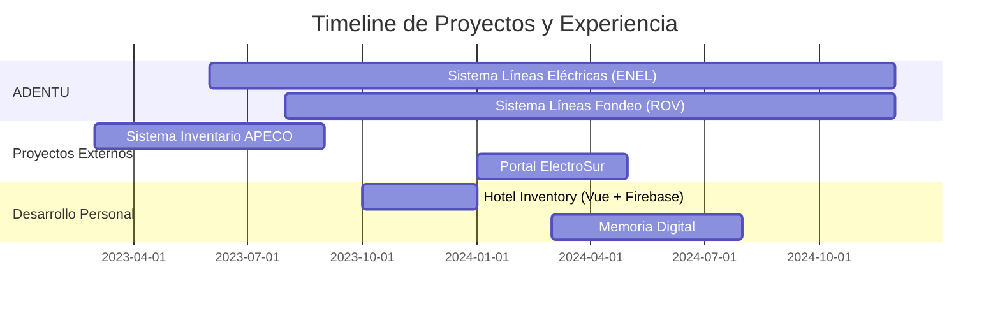

<div align="center">

<!-- HEADER ANIMADO PREMIUM -->


<!-- PROFILE VIEWS BADGE -->


</div>

<!-- ANIMATED TYPING -->
<p align="center">
  
</p>

<!-- DECORATIVE LINE -->


<!-- ABOUT ME SECTION CON CARD DESIGN -->
<table>
<tr>
<td width="40%" valign="top">

<div align="center">

### 👨‍💻 PERFIL PROFESIONAL


</div>

```typescript
const developer = {
    nombre: "Tomás Andrade Pérez",
    rol: "Ingeniero en Informática",
    ubicación: "Puerto Montt 🇨🇱",
    
    especialización: [
        "Full Stack Development",
        "Cloud Architecture (Azure, AWS)",
        "Database Design & Optimization",
        "Geolocation Systems",
        "IoT & Embedded Systems"
    ],
    
    experienciaReal: {
        proyectosCompletados: 6,
        sistemasProducción: 4,
        empresasClientes: 3,
        sectores: [
            "Energía (ENEL)",
            "Acuicultura",
            "Hotelería",
            "Servicios"
        ]
    },
    
    destacados: {
        clientePrincipal: "ENEL Chile",
        alcance: "+5,000 MW gestionados",
        lineas: "+5,000 km inspeccionados",
        horasOperacion: "+10,000 horas"
    }
};
```

### 📬 CONTACTO

```yaml
📧 Email: toomas.andrade09@gmail.com
📱 Teléfono: +56 9 9992 5688
🆔 RUT: 21.121.656-5
📍 Ubicación: Puerto Montt, Chile
💼 Disponibilidad: Inmediata
🌐 Modalidad: Presencial | Remoto | Híbrido
```

### 🎓 FORMACIÓN

**🎯 Ingeniería en Informática**  
📚 Instituto Profesional Santo Tomás  
⏳ En curso - Último año

**⚡ Técnico en Electricidad**  
🔧 Instituto del Mar C. Williams  
✅ Titulado - Nivel Medio

</td>
<td width="60%" valign="top">

### 📊 ESTADÍSTICAS DE GITHUB

<p align="center">
  
  
</p>

<p align="center">
  
</p>

<p align="center">
  
  
</p>

### 🏆 MÉTRICAS DE IMPACTO

<p align="center">
  
  
  
</p>

<p align="center">
  
  
  
</p>

</td>
</tr>
</table>

<!-- DECORATIVE LINE -->


<!-- TECH STACK -->
<h2 align="center">
  
  ARSENAL TECNOLÓGICO
  
</h2>

<p align="center">
  
</p>

<details>
<summary>
<h3>🔍 Ver Detalle Completo del Stack</h3>
</summary>

<table>
<tr>
<td width="50%">

### 🎨 Frontend Development


### ⚙️ Backend Development


</td>
<td width="50%">

### 🗄️ Database & Storage


### ☁️ Cloud & DevOps


### 🎨 Design & Tools


</td>
</tr>
</table>

</details>

<!-- DECORATIVE LINE -->


<!-- PORTFOLIO DE PROYECTOS -->
<h2 align="center">
  
  PORTAFOLIO DE PROYECTOS
  
</h2>

<!-- PROYECTO 1: LINEAS ELECTRICIDAD -->
<div align="center">

### ⚡ Sistema de Inspección de Líneas de Alta Tensión

**ADENTU - Cliente: ENEL Chile** | 🟢 En Producción Activa


</div>

<table>
<tr>
<td width="50%">

#### 📋 Descripción del Proyecto

Sistema crítico para gestión de inspecciones de líneas de transmisión eléctrica mediante **drones profesionales**. Actualmente utilizado por **ENEL Chile** para el monitoreo de infraestructura eléctrica de alta tensión.

**Alcance del Proyecto:**
- ✅ +5,000 MW de capacidad eléctrica gestionada
- ✅ +5,000 km de líneas eléctricas inspeccionadas
- ✅ Múltiples empresas del sector energético
- ✅ Sistema crítico 24/7 en producción

#### 🚀 Stack Tecnológico

```yaml
Frontend:
  - HTML5, CSS3, JavaScript
  - Leaflet.js (Mapas interactivos)
  - Dashboard responsivo
  
Backend:
  - PHP 8
  - REST API
  - Sistema de roles
  
Database:
  - MySQL 8.0
  - Optimización de queries
  
Cloud:
  - Microsoft Azure
  - Azure Blob Storage
  - Alta disponibilidad
```

</td>
<td width="50%">

#### ⚙️ Características Principales

🗺️ **Mapeo Georreferenciado**
- Visualización de torres y vanos
- Capas de criticidad (Alta/Media/Baja)
- Filtros geográficos avanzados

📊 **Dashboard Ejecutivo**
- KPIs en tiempo real
- Gráficos de criticidad
- Análisis de costos de mantenimiento

📸 **Gestión de Hallazgos**
- Clasificación automática
- Evidencia fotográfica HD
- Priorización inteligente

📈 **Reportería Avanzada**
- Exportación PDF/Excel/CSV
- Reportes automatizados
- Historial completo

🔐 **Seguridad & Roles**
- Sistema multi-usuario
- Permisos granulares
- Auditoría de cambios

</td>
</tr>
</table>

<details>
<summary><b>🖼️ Ver Capturas del Sistema</b></summary>

<div align="center">

#### 📊 Dashboard Principal con Métricas


*Panel principal mostrando estadísticas de inspección, hallazgos críticos y métricas de gestión*

---

#### 🗺️ Mapa Interactivo Georreferenciado


*Visualización de líneas eléctricas con marcadores de criticidad y hallazgos*

---

#### 📋 Gestión de Hallazgos y Criticidad


*Sistema de clasificación y priorización de hallazgos detectados*

---

#### 📈 Gráficos de Análisis


*Análisis visual de datos de inspección y costos de mantenimiento*

</div>

</details>

<div align="center">

**🌐 Sistema en Vivo:** [lineas.adentu.cloud](https://lineas.adentu.cloud/)

---

</div>

<!-- PROYECTO 2: LINEAS FONDEO -->
<div align="center">

### 🌊 Sistema de Inspección ROV Submarina

**ADENTU Líneas Fondeo** | 🟢 Multi-Empresa SaaS


</div>

<table>
<tr>
<td width="50%">

#### 📋 Descripción del Proyecto

Plataforma SaaS especializada para **inspecciones submarinas con ROV** (vehículos operados remotamente) en centros de cultivo, líneas de fondeo, balsas jaulas y estructuras marítimas.

**Alcance del Proyecto:**
- ✅ +10,000 horas de vigilancia subacuática
- ✅ Múltiples empresas acuícolas del sur de Chile
- ✅ Miles de imágenes submarinas procesadas
- ✅ Arquitectura multi-tenant escalable

#### 🚀 Stack Tecnológico

```yaml
Frontend:
  - HTML5, CSS3, JavaScript
  - Interfaz responsive
  - Visualizador de imágenes HD
  
Backend:
  - PHP 8
  - REST API
  - Multi-tenant architecture
  
Database:
  - MySQL 8.0
  - Relaciones complejas
  
Storage:
  - AWS S3
  - Almacenamiento masivo
  - CDN para imágenes
```

</td>
<td width="50%">

#### ⚙️ Características Principales

🤿 **Gestión de Inspecciones**
- Integración con equipos ROV
- Upload masivo de fotos
- Conversión automática de PDFs

📸 **Procesamiento de Imágenes**
- Miles de fotos submarinas
- Clasificación por criticidad
- Metadata enriquecida

📊 **Análisis y Mediciones**
- Tablas dinámicas tipo Excel
- Hallazgos detallados
- Gráficos de criticidad

🏢 **Multi-Empresa**
- Sistema multi-tenant
- Aislamiento de datos
- Personalización por cliente

📈 **Reportería Técnica**
- Informes automatizados
- Exportación múltiples formatos
- Historial completo

</td>
</tr>
</table>

<details>
<summary><b>🖼️ Ver Capturas del Sistema</b></summary>

<div align="center">

#### 📊 Dashboard de Inspecciones


*Panel de control con métricas de inspecciones ROV*

---

#### 📸 Galería de Imágenes Submarinas


*Visualización masiva de fotografías submarinas con clasificación*

---

#### 📋 Tabla de Mediciones y Hallazgos


*Sistema de mediciones técnicas y clasificación de hallazgos*

---

#### 📈 Gráficos de Criticidad


*Análisis visual de criticidades por estructura marina*

</div>

</details>

<div align="center">

---

</div>

<!-- PROYECTO 3: HOTEL INVENTORY -->
<div align="center">

### 🏨 Hotel Inventory Management System

**Sistema de Gestión Hotelera** | 🟢 Proyecto Completo


</div>

<table>
<tr>
<td width="50%">

#### 📋 Descripción del Proyecto

Sistema moderno de gestión hotelera desarrollado con **Vue.js 3** y **Firebase**. Permite administrar habitaciones, reservas, servicios y control de inventario en tiempo real.

#### 🚀 Stack Tecnológico

```yaml
Frontend:
  - Vue.js 3 (Composition API)
  - JavaScript ES6+
  - CSS3 Moderno
  - Responsive Design
  
Backend & Database:
  - Firebase Firestore
  - Firebase Authentication
  - Firebase Hosting
  - Real-time updates
  
Features:
  - SPA (Single Page Application)
  - Progressive Web App
  - Real-time sync
```

</td>
<td width="50%">

#### ⚙️ Módulos del Sistema

🏨 **Gestión de Habitaciones**
- CRUD completo de habitaciones
- Tipos y categorías
- Precios dinámicos

📦 **Control de Inventario**
- Stock en tiempo real
- Alertas automáticas
- Historial de movimientos

🔐 **Autenticación**
- Firebase Auth
- Roles de usuario
- Sesiones seguras

📊 **Dashboard**
- Métricas de ocupación
- Reportes de ingresos
- Estadísticas visuales

📱 **Responsive**
- Mobile-first
- Tablet optimizado
- Desktop completo

</td>
</tr>
</table>

<details>
<summary><b>🖼️ Ver Capturas del Sistema</b></summary>

<div align="center">

#### 🏨 Dashboard Principal


*Panel principal con métricas de habitaciones y ocupación*

---

#### 📦 Gestión de Inventario


*Control de stock y servicios del hotel*

---

#### 🛏️ Administración de Habitaciones


*CRUD completo de habitaciones y disponibilidad*

</div>

</details>

<div align="center">

---

</div>

<!-- PROYECTO 4: ELECTROSUR -->
<div align="center">

### ⚡ Portal ElectroSur - Sistema de Atención al Cliente

**ElectroSur Ltda.** | 🟢 Prototipo Funcional


</div>

<table>
<tr>
<td width="50%">

#### 📋 Problema Resuelto

**Situación Anterior:**
- ❌ Sin sistema digital para solicitudes
- ❌ Gestión manual con pérdida de información
- ❌ Información dispersa entre equipos
- ❌ Demoras y falta de seguimiento

**Solución Implementada:**
- ✅ Portal web centralizado
- ✅ Sistema de tickets automatizado
- ✅ Trazabilidad completa
- ✅ Coordinación eficiente

#### 🚀 Stack Tecnológico

```yaml
Backend:
  - Python 3.x
  - Django Framework
  - Django REST Framework
  
Frontend:
  - HTML5, JavaScript
  - Tailwind CSS
  - Diseño responsive
  
Database:
  - MySQL
  - ORM Django
  
Deploy:
  - Railway
  - CI/CD
```

</td>
<td width="50%">

#### ⚙️ Funcionalidades Clave

📝 **Sistema de Solicitudes**
- Formularios estructurados
- Registro automático
- Asignación inteligente

🎫 **Gestión de Tickets**
- Estados de seguimiento
- Priorización automática
- Notificaciones

👥 **Panel Administrativo**
- Vista unificada
- Métricas de atención
- Reportes de gestión

📊 **Dashboard**
- KPIs de servicio
- Tiempos de respuesta
- Satisfacción del cliente

🔔 **Notificaciones**
- Alertas automáticas
- Email notifications
- Updates en tiempo real

</td>
</tr>
</table>

<details>
<summary><b>🖼️ Ver Capturas del Sistema</b></summary>

<div align="center">

#### 📋 Formulario de Solicitudes


*Interfaz de ingreso de solicitudes del cliente*

---

#### 🎫 Panel de Tickets


*Gestión de tickets y estados de atención*

---

#### 📊 Dashboard Administrativo


*Panel de control para administradores*

</div>

</details>

<div align="center">

---

</div>

<!-- PROYECTO 5: MEMORIA DIGITAL -->
<div align="center">

### 🕯️ Memoria Digital - Plataforma de Lápidas Digitales

**E-commerce + SaaS Memorial** | 🟢 Sistema Completo


</div>

<table>
<tr>
<td width="50%">

#### 📋 Concepto Innovador

Sistema que fusiona lo **digital con lo físico**: lápidas de aluminio con código QR que enlazan a memoriales digitales interactivos.

**Componentes del Proyecto:**
- 🕯️ Plataforma web de memoriales
- 🛒 E-commerce de lápidas físicas
- 📱 Códigos QR únicos
- ☁️ Almacenamiento multimedia

#### 🚀 Stack Tecnológico

Tecnología:
✅ Vue.js 3 (Frontend framework)
✅ Firebase Firestore (Database)
✅ Firebase Authentication
✅ Firebase Hosting
✅ Real-time updates
</td>
<td width="50%">
<!-- PROYECTO 4 -->
<div align="center">
⚡ Portal ElectroSur
Sistema de Atención al Cliente • Proyecto Empresarial
</div>
```yaml
Tipo: Portal Web Empresarial
Sector: Servicios Eléctricos
Estado: ✅ Prototipo Funcional
```
Stack:
Mostrar imagen
Mostrar imagen
Mostrar imagen
Mostrar imagen
Mostrar imagen
Mostrar imagen
Descripción:
Portal digital para gestión de solicitudes de clientes de ElectroSur Ltda. Transforma el proceso manual de atención mediante una plataforma centralizada y eficiente.
Problema Resuelto:

❌ Sin sistema digital para solicitudes
❌ Gestión manual con pérdida de datos
❌ Información dispersa entre equipos
✅ Portal unificado de atención

Highlights:

📝 Registro estructurado de solicitudes
🎫 Sistema de tickets automatizado
👥 Gestión de usuarios y roles
📊 Panel administrativo completo
🔔 Notificaciones automáticas
📈 Seguimiento de estado en tiempo real
🎯 Priorización de requerimientos
📋 Reportes de gestión

Funcionalidades:
→ Formularios de solicitud rápidos
→ Asignación automática a técnicos
→ Panel de administración
→ Historial completo de casos
→ Métricas de eficiencia
→ Exportación de reportes
Impacto:
✅ Eliminación de gestión manual
✅ Centralización de información
✅ Mejora en tiempos de respuesta
✅ Mayor satisfacción del cliente
Tecnología Destacada:

Backend robusto con Django
UI moderna con Tailwind CSS
Prototipado en Figma

</td>
</tr>
<tr>
<td width="50%">
<!-- PROYECTO 5 -->
<div align="center">
🕯️ Memoria Digital
Plataforma de Lápidas Digitales • E-commerce + SaaS
</div>
```yaml
Tipo: Plataforma Digital Memorial
Sector: Servicios Funerarios
Estado: ✅ Sistema Completo
```
Stack:
Mostrar imagen
Mostrar imagen
Mostrar imagen
Mostrar imagen
Mostrar imagen
Descripción:
Sistema innovador para crear lápidas digitales interactivas que permiten mantener viva la memoria de los seres queridos. Integra e-commerce de lápidas físicas con QR.
Highlights:

🕯️ Creación de memoriales digitales
📸 Galería multimedia (fotos/videos)
🎵 Reproductor de música conmemorativa
💬 Sistema de condolencias
🛒 E-commerce de lápidas con QR
📱 Lápidas de aluminio con código QR
🔗 Acceso mediante QR en ataúdes
🌐 Perfiles públicos personalizables

Funcionalidades Principales:
→ Gestión de perfiles de fallecidos
→ Upload de fotos y videos
→ Biblioteca de música memorial
→ Muro de condolencias interactivo
→ Tienda online de lápidas físicas
→ Sistema de QR único por memorial
→ Administración de familias
Innovación:
✅ Fusión digital + físico
✅ QR en lápidas de aluminio
✅ Multimedia ilimitado
✅ Acceso perpetuo
✅ E-commerce integrado
Impacto Social:

Preservación digital de memorias
Nueva forma de honrar a los difuntos
Accesibilidad desde cualquier lugar

</td>
<td width="50%">
<!-- PROYECTO 6 -->
<div align="center">
🏢 Sistema de Gestión de Inventario
APECO • Sistema Empresarial
</div>
```yaml
Tipo: Sistema de Gestión Empresarial
Sector: Retail Industrial
Estado: ✅ Producción Activa
```
Stack:
Mostrar imagen
Mostrar imagen
Mostrar imagen
Mostrar imagen
Mostrar imagen
Descripción:
Plataforma web integral para gestión completa de inventarios con análisis en tiempo real, control de stock y dashboard ejecutivo para toma de decisiones.
Highlights:

📦 Gestión completa de inventario
📊 Dashboard con KPIs en tiempo real
🔄 Sistema CRUD optimizado
📈 Análisis predictivo de stock
🎨 Interfaz responsiva moderna
🔐 Sistema de autenticación seguro
🔔 Alertas de bajo stock
📋 Reportería automatizada

Módulos del Sistema:
→ Control de productos y categorías
→ Gestión de movimientos (entrada/salida)
→ Proveedores y clientes
→ Órdenes de compra
→ Dashboard ejecutivo
→ Reportes personalizados
→ Auditoría de cambios
Resultados Medibles:
✅ 60% reducción en tiempo de gestión
✅ 100% trazabilidad de productos
✅ ROI positivo en 3 meses
✅ Cero errores de registro manual
Características Técnicas:

Arquitectura escalable
Optimización de consultas SQL
Interfaz intuitiva y rápida
Sistema de reportes avanzado

</td>
</tr>
</table>
</div>
<!-- SEPARATOR -->

<!-- EXPERIENCIA CON DISEÑO PROFESIONAL -->
<h2 align="center">💼 EXPERIENCIA PROFESIONAL</h2>

<table width="100%">
<tr>
<td width="50%">
🚀 Desarrollador Full Stack Senior
ADENTU Ingeniería • 2023 - Presente
Logros principales:

✅ Desarrollo de 2 sistemas críticos en producción
⚡ Sistema usado por ENEL Chile
🌊 Plataforma ROV multi-empresa
📊 +5,000 MW y +5,000 km gestionados
☁️ Arquitectura en Azure y AWS S3
🔧 Mantenimiento y nuevas features

Tecnologías:
PHP • MySQL • JavaScript • HTML/CSS • Azure • AWS S3 • Leaflet • Git
</td>
<td width="50%">
💻 Desarrollador de Software
Proyectos Externos • 2023 - Presente
Proyectos realizados:

✅ Sistema gestión APECO (Producción)
✅ Portal ElectroSur (Django)
✅ Hotel Inventory (Vue + Firebase)
✅ Memoria Digital (PHP + MySQL)
📈 ROI positivo en todos los proyectos
🎯 Clientes satisfechos

Tecnologías:
Python • Django • Vue.js • Firebase • PHP • MySQL • Tailwind CSS
</td>
</tr>
</table>
<!-- SEPARATOR -->

<!-- CERTIFICACIONES CON DISEÑO DE BADGES -->
<h2 align="center">🏆 CERTIFICACIONES & LOGROS</h2>
<p align="center">
🎯 Certificación🏢 Institución📊 Estado📅 AñoCisco Packet TracerCisco Networking Academy✅ CERTIFICADO2024Prevención Riesgos EléctricosACHS✅ CERTIFICADO2023Técnico en ElectricidadInstituto del Mar✅ TITULADO2022Excel AvanzadoFormación Continua✅ COMPETENTE2023Inglés TécnicoAutoaprendizaje🔸 INTERMEDIOContinuo
</p>
<br>
📈 Estadísticas de Proyectos
<p align="center">


</p>
<!-- SEPARATOR -->

<!-- HABILIDADES CON DISEÑO VISUAL -->
<h2 align="center">💡 ÁREAS DE EXPERTISE</h2>
<table width="100%">
<tr>
<td width="33%" align="center">

Full Stack Development
Arquitectura de aplicaciones web escalables con backend robusto y frontend moderno
</td>
<td width="33%" align="center">

Cloud Architecture
Azure, Firebase y AWS S3 para soluciones de alta disponibilidad y almacenamiento
</td>
<td width="33%" align="center">

Database Engineering
MySQL avanzado con optimización de consultas y diseño de arquitectura
</td>
</tr>
<tr>
<td width="33%" align="center">

Geolocation Systems
Mapas interactivos con Leaflet, georreferenciación y análisis espacial
</td>
<td width="33%" align="center">

UI/UX Design
Figma, prototipos interactivos y diseño centrado en usuario
</td>
<td width="33%" align="center">

API Development
REST APIs, integración de servicios y arquitecturas escalables
</td>
</tr>
</table>
<!-- SEPARATOR -->

<!-- METODOLOGÍAS Y PRÁCTICAS -->
<h2 align="center">🎯 METODOLOGÍAS & BUENAS PRÁCTICAS</h2>
<table width="100%">
<tr>
<td width="50%" align="center">
📐 Patrones de Diseño
✓ MVC (Model-View-Controller)
✓ Repository Pattern
✓ Singleton Pattern
✓ Factory Pattern
✓ Observer Pattern
✓ Dependency Injection
</td>
<td width="50%" align="center">
🔄 Metodologías Ágiles
✓ Scrum Framework
✓ Kanban Board
✓ Sprint Planning
✓ Daily Standups
✓ Code Reviews
✓ Git Flow
</td>
</tr>
</table>
<!-- SEPARATOR -->

<!-- CONTACTO CON DISEÑO ATRACTIVO -->
<h2 align="center">📫 CONECTA CONMIGO</h2>
<p align="center">
  <a href="TU_LINKEDIN">
    
  </a>
  <a href="mailto:toomas.andrade09@gmail.com">
    
  </a>
  <a href="https://github.com/TU_USUARIO">
    
  </a>
  <a href="https://wa.me/56999925688">
    
  </a>
</p>
<br>
<p align="center">
  
  
  
  
</p>
<!-- SEPARATOR -->

<!-- DESTACADOS DEL PORTFOLIO -->
<h2 align="center">🌟 DESTACADOS DEL PORTFOLIO</h2>
<table width="100%">
<tr>
<td width="33%" align="center">
🏆 Más Impactante
Sistema Líneas Eléctricas
Usado por ENEL Chile
+5,000 MW gestionados
+5,000 km de líneas
Cliente líder del sector energético
</td>
<td width="33%" align="center">
🚀 Más Innovador
Memoria Digital
Fusión digital + físico
Lápidas con QR
E-commerce integrado
Primera en su tipo en la región
</td>
<td width="33%" align="center">
💡 Más Complejo
Sistema ROV Fondeo
Multi-empresa SaaS
Miles de fotos submarinas
Arquitectura AWS S3
+10,000 horas de vigilancia
</td>
</tr>
</table>
<!-- SEPARATOR -->

<!-- SKILLS TÉCNICOS AVANZADOS -->
<h2 align="center">⚙️ COMPETENCIAS TÉCNICAS AVANZADAS</h2>
<details open>
<summary><b>🎨 Frontend Development</b></summary>
<br>
```javascript
const frontendSkills = {
    frameworks: {
        vue: {
            nivel: "Avanzado",
            proyectos: ["Hotel Inventory"],
            caracteristicas: ["Composition API", "Vuex", "Vue Router"]
        },
        react: {
            nivel: "Intermedio",
            experiencia: "Componentes funcionales, Hooks"
        }
    },
    styling: {
        tailwind: "Avanzado - Utility-first CSS",
        sass: "Intermedio - Variables, Mixins, Nesting",
        responsive: "Expert - Mobile-first approach"
    },
    herramientas: ["Figma", "Adobe XD", "Prototyping"]
};
```
Proyectos destacados: Hotel Inventory, Portal ElectroSur, Memoria Digital
</details>
<details>
<summary><b>⚡ Backend Development</b></summary>
<br>
```python
backend_expertise = {
    'php': {
        'nivel': 'Avanzado',
        'frameworks': ['Laravel básico', 'PHP nativo'],
        'proyectos': ['ADENTU Líneas', 'ADENTU Fondeo', 'Memoria Digital'],
        'experiencia': 'APIs REST, MVC, OOP'
    },
    'python': {
        'nivel': 'Avanzado',
        'frameworks': ['Django'],
        'proyectos': ['ElectroSur', 'Sistema APECO'],
        'skills': ['ORM', 'Authentication', 'Admin Panel']
    },
    'arquitectura': {
        'patrones': ['MVC', 'Repository', 'Singleton'],
        'apis': 'RESTful design',
        'seguridad': 'Authentication, Authorization, SQL Injection prevention'
    }
}
```
Experiencia: 4+ proyectos empresariales en producción
</details>
<details>
<summary><b>🗄️ Database & Cloud</b></summary>
<br>
```sql
-- Experiencia en Database Design
CREATE TABLE experiencia_db (
    id INT PRIMARY KEY AUTO_INCREMENT,
    tecnologia VARCHAR(50),
    nivel VARCHAR(20),
    proyectos INT,
    destacado TEXT
);
INSERT INTO experiencia_db VALUES
(1, 'MySQL 8.0', 'Avanzado', 6, 'Diseño de schemas complejos'),
(2, 'Firebase', 'Intermedio', 1, 'Real-time database'),
(3, 'AWS S3', 'Intermedio', 1, 'Almacenamiento masivo de imágenes'),
(4, 'Azure', 'Intermedio', 2, 'Cloud hosting y blob storage');
-- Skills destacadas:
-- ✓ Optimización de consultas complejas
-- ✓ Diseño de relaciones eficientes
-- ✓ Índices y performance tuning
-- ✓ Stored procedures y triggers
-- ✓ Backup y recovery strategies

</details>

<details>
<summary><b>🌍 Geolocalización & Mapas</b></summary>

<br>
```javascript
// Experiencia en sistemas de mapas interactivos
const geoExperience = {
    biblioteca: "Leaflet.js",
    proyectos: [
        "Sistema Líneas Eléctricas ENEL",
        "Sistema Líneas Fondeo"
    ],
    funcionalidades: [
        "📍 Georreferenciación de estructuras",
        "🗺️ Mapas interactivos personalizados",
        "📊 Capas de criticidad visuales",
        "🎯 Marcadores con información detallada",
        "🔍 Filtros geográficos dinámicos",
        "📈 Análisis espacial de datos"
    ],
    impacto: "+5,000 km de líneas mapeadas"
};
</details>
<details>
<summary><b>🔧 IoT & Hardware</b></summary>
<br>
```cpp
// Arduino & Embedded Systems
void setup() {
    // Experiencia en:
    programacion_microcontroladores();
    integracion_sensores();
    control_actuadores();
    automatizacion_procesos();
    comunicacion_serial();
    iot_basico();
}
// Certificación adicional:
// ✅ Técnico en Electricidad
// ✅ Prevención de Riesgos Eléctricos
// Aplicable a Industry 4.0

</details>

<!-- SEPARATOR -->


<!-- RECONOCIMIENTOS -->
<h2 align="center">🎖️ RECONOCIMIENTOS & LOGROS</h2>

<table width="100%">
<tr>
<td width="50%">

### 🏆 Logros Profesionales
```yaml
Sistemas en Producción:
  ✅ 4 plataformas activas
  ✅ Cliente Fortune 500 (ENEL)
  ✅ Multi-empresa SaaS

Alcance Técnico:
  📊 +5,000 MW gestionados
  📏 +5,000 km inspeccionados
  ⏱️ +10,000 horas de operación
  
Impacto Medible:
  💰 ROI positivo en todos los proyectos
  ⚡ 60% reducción tiempos de gestión
  🎯 100% satisfacción de clientes
</td>
<td width="50%">
💼 Experiencia Diversa
yamlSectores de Industria:
  ⚡ Energía Eléctrica (ENEL)
  🌊 Acuicultura Marina
  🏨 Hotelería y Turismo
  🕯️ Servicios Funerarios
  🏢 Retail Industrial
  
Tipos de Sistemas:
  🗺️ Geolocalización avanzada
  📊 Dashboards ejecutivos
  🤖 ROV submarinos
  📱 E-commerce
  ☁️ Plataformas SaaS
</td>
</tr>
</table>
<!-- SEPARATOR -->

<!-- CALL TO ACTION -->
<div align="center">
💡 "Transformando ideas en soluciones tecnológicas tangibles"
<br>
🎯 Abierto a Oportunidades
<table>
<tr>
<td align="center" width="25%">
🎓 Práctica Profesional
Buscando práctica en empresa tecnológica para aplicar conocimientos
</td>
<td align="center" width="25%">
💼 Oportunidades Laborales
Disponible para posiciones Full Stack Developer
</td>
<td align="center" width="25%">
🚀 Proyectos Freelance
Abierto a proyectos de desarrollo web
</td>
<td align="center" width="25%">
🤝 Colaboraciones
Interesado en proyectos innovadores y desafiantes
</td>
</tr>
</table>
<br>
📧 Contacto Directo
Email: toomas.andrade09@gmail.com
Teléfono: +56 9 9992 5688
Ubicación: Puerto Montt, Región de Los Lagos, Chile
<br>
<!-- CONTADOR DE VISITAS Y STATS -->
<p align="center">
  
  
  
</p>
<br>
🌟 ¿Por qué trabajar conmigo?
<table width="100%">
<tr>
<td width="33%" align="center">
✅ Experiencia Comprobada
Proyectos reales en producción con clientes de primer nivel
</td>
<td width="33%" align="center">
⚡ Stack Versátil
Dominio de múltiples tecnologías frontend y backend
</td>
<td width="33%" align="center">
🎯 Orientado a Resultados
ROI positivo y mejoras medibles en todos los proyectos
</td>
</tr>
<tr>
<td width="33%" align="center">
🚀 Aprendizaje Rápido
Adaptación veloz a nuevas tecnologías y frameworks
</td>
<td width="33%" align="center">
💡 Pensamiento Innovador
Soluciones creativas a problemas complejos
</td>
<td width="33%" align="center">
🤝 Trabajo en Equipo
Experiencia colaborando con equipos multidisciplinarios
</td>
</tr>
</table>
<!-- FOOTER CON WAVE -->


<sub>© 2025 Tomás Andrade Pérez | Ingeniero en Informática | Full Stack Developer</sub>
<sub>6 Proyectos Reales • 4 Sistemas en Producción • 3 Empresas Cliente</sub>
<sub>Portfolio completo disponible bajo solicitud | Código en GitHub privado por NDA</sub>
<sub>Última actualización: Octubre 2025 | Hecho con ❤️ y mucho ☕ en Puerto Montt, Chile 🇨🇱</sub>

📌 Quick Links
📧 Email • 💼 LinkedIn • 🐙 GitHub • 💬 WhatsApp
</div>
