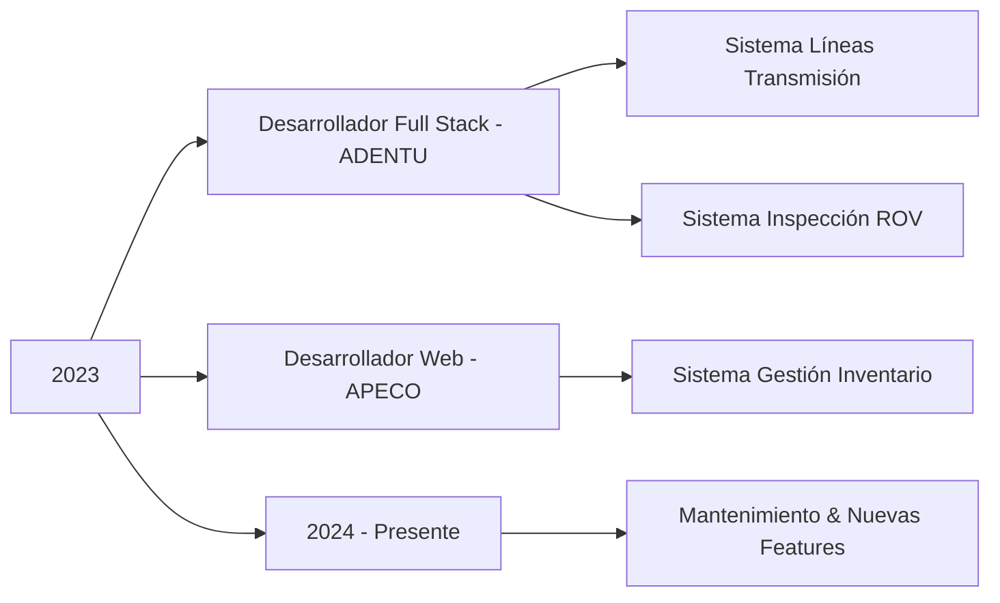

<div align="center">

<!-- HEADER CON DISEÑO MINIMALISTA -->


</div>

<!-- TYPING ANIMATION -->
<p align="center">
  
</p>

<!-- WAVE SEPARATOR -->


<!-- LAYOUT PRINCIPAL CON DISEÑO GRID -->
<table width="100%">
<tr>
<td width="35%" valign="top">


### 🎯 SOBRE MÍ

```typescript
const developer = {
    nombre: "Tomás Andrade Pérez",
    rol: "Ingeniero en Informática",
    ubicación: "Puerto Montt 🇨🇱",
    
    especialización: [
        "Full Stack Development",
        "Cloud Architecture",
        "Database Design",
        "UI/UX Engineering"
    ],
    
    mentalidad: {
        aprendizaje: "continuo",
        enfoque: "soluciones reales",
        calidad: "siempre primero"
    }
};
```

<br>

### 📍 CONTACTO

```yaml
📧 toomas.andrade09@gmail.com
📱 +56 9 9992 5688
🆔 21.121.656-5
📍 Puerto Montt, Chile
🌐 Disponibilidad: Inmediata
💼 Modalidad: Todas
```

<br>

### 🎓 FORMACIÓN

**Ingeniería en Informática**  
📚 Instituto Profesional Santo Tomás  
⏳ En curso - Último año

**Técnico en Electricidad**  
🔧 Instituto del Mar C. Williams  
✅ Titulado

</td>
<td width="65%" valign="top">

<!-- SECCIÓN DE ESTADÍSTICAS CON DISEÑO MODERNO -->
### 📊 MÉTRICAS DE DESARROLLO

<p align="center">
  
  
</p>

<p align="center">
  
</p>

<p align="center">
  
</p>

</td>
</tr>
</table>

<!-- SEPARATOR -->


<!-- TECH STACK CON DISEÑO ICONOGRÁFICO -->
<h2 align="center">⚡ ARSENAL TECNOLÓGICO</h2>

<p align="center">
  
</p>

<details>
<summary><b>🔍 Ver Stack Completo Detallado</b></summary>

<br>

<table width="100%">
<tr>
<td width="25%">

**Frontend**
```
→ HTML5
→ CSS3
→ JavaScript
→ Vue.js
→ React
→ SASS
```

</td>
<td width="25%">

**Backend**
```
→ Python
→ PHP 8
→ Java
→ C++
→ C#
→ .NET
```

</td>
<td width="25%">

**Database**
```
→ MySQL 8
→ SQL Server
→ Database Design
→ Query Optimization
```

</td>
<td width="25%">

**DevOps & Cloud**
```
→ Azure
→ Git/GitHub
→ REST APIs
→ Docker (básico)
```

</td>
</tr>
<tr>
<td width="25%">

**Frameworks**
```
→ Laravel
→ Bootstrap
→ Tailwind CSS
```

</td>
<td width="25%">

**Tools**
```
→ VS Code
→ PyCharm
→ Android Studio
→ Jira
```

</td>
<td width="25%">

**Design**
```
→ Figma
→ Adobe XD
→ AutoCAD
→ UI/UX
```

</td>
<td width="25%">

**Otros**
```
→ Arduino
→ Cisco Packet
→ Excel Avanzado
→ Inglés Intermedio
```

</td>
</tr>
</table>

</details>

<!-- SEPARATOR -->


<!-- PORTAFOLIO DE PROYECTOS CON DISEÑO CARD -->
<h2 align="center">🚀 PORTAFOLIO DE PROYECTOS</h2>

<div align="center">
<table>
<tr>
<td width="50%">

<!-- PROYECTO 1 -->
<div align="center">
  
### 🏢 Sistema de Gestión de Inventario
**APECO** • `En Producción`

</div>

```yaml
Tipo: Sistema Empresarial
Sector: Retail Industrial
Estado: ✅ Activo en Producción
```

**Stack:**  


**Descripción:**  
Plataforma web integral para gestión de inventarios con análisis en tiempo real y dashboard ejecutivo.

**Highlights:**
- 📊 Dashboard con KPIs en tiempo real
- 🔄 Sistema CRUD completo optimizado
- 📈 Análisis predictivo de stock
- 🎨 Interfaz responsiva moderna
- 🔐 Autenticación segura

**Impacto:**
```
→ 60% reducción en tiempo de gestión
→ 100% trazabilidad de productos
→ ROI positivo en 3 meses
```

</td>
<td width="50%">

<!-- PROYECTO 2 -->
<div align="center">
  
### ⚡ App Líneas de Transmisión
**ADENTU** • `Multi-Empresa`

</div>

```yaml
Tipo: Infraestructura Crítica
Sector: Energía Eléctrica
Estado: ✅ Producción Activa
```

**Stack:**  


**Descripción:**  
Sistema para inspecciones y mantenimiento de redes eléctricas de alta tensión con priorización inteligente.

**Highlights:**
- 🗺️ Mapeo georreferenciado de líneas
- 🚨 Alertas prioritarias automáticas
- 📸 Gestión de evidencia fotográfica
- 📊 Reportes técnicos automatizados
- ⚡ Actualización en tiempo real

**En vivo:**  
🌐 [lineas.adentu.cloud](https://lineas.adentu.cloud/)

**Impacto:**
```
→ Múltiples empresas usando el sistema
→ 45% mejora en tiempos de respuesta
→ Mayor seguridad operacional
```

</td>
</tr>

<tr>
<td width="50%">

<!-- PROYECTO 3 -->
<div align="center">
  
### 🌊 Sistema de Inspección ROV
**ADENTU Fondeo** • `SaaS Multi-Tenant`

</div>

```yaml
Tipo: Inspección Submarina
Sector: Acuicultura Marítima
Estado: ✅ Multi-Empresa Activo
```

**Stack:**  


**Descripción:**  
Plataforma especializada para inspecciones submarinas con ROV en centros de cultivo y estructuras marítimas.

**Highlights:**
- 🤿 Integración con equipos ROV
- 🎥 Gestión de video HD/4K submarina
- 📋 Protocolos estandarizados
- 🏭 Sistema multi-empresa adaptable
- 📊 Informes técnicos automatizados

**Impacto:**
```
→ Varias empresas del sur de Chile
→ 70% reducción en tiempo de informes
→ Estándar en inspecciones submarinas
```

</td>
<td width="50%">

<!-- PROYECTO 4 -->
<div align="center">
  
### 🔌 Simulador de Redes
**Cisco Packet Tracer** • `Certificado`

</div>

```yaml
Tipo: Networking & Hardware
Sector: Infraestructura de Redes
Estado: ✅ Certificado Oficial
```

**Stack:**  


**Descripción:**  
Diseño y configuración de topologías de red empresariales complejas con protocolos avanzados.

**Highlights:**
- 🌐 Configuración de routers Cisco IOS
- 🔄 Protocolos RIP, OSPF, EIGRP
- 🏢 VLANs y segmentación de redes
- 🔐 ACLs y seguridad de red
- ⚡ Redundancia y alta disponibilidad

**Certificación:**
```
✅ Cisco Packet Tracer Official
✅ Network Design & Troubleshooting
✅ Enterprise Infrastructure
```

</td>
</tr>

<tr>
<td width="50%">

<!-- PROYECTO 5 -->
<div align="center">
  
### 🤖 Sistema IoT con Arduino
**Control Automatizado** • `Prototipo Funcional`

</div>

```yaml
Tipo: IoT & Automatización
Sector: Industry 4.0
Estado: ✅ Funcional
```

**Stack:**  


**Descripción:**  
Sistema de automatización con sensores y actuadores para control de procesos en tiempo real.

**Highlights:**
- 🎛️ Programación de microcontroladores
- 📡 Sensores múltiples integrados
- ⚙️ Actuadores eléctricos
- 🔄 Lógica de control automatizada
- 📊 Comunicación serial/WiFi

**Tecnologías:**
```
→ Arduino C++
→ Sensores IoT (temp, humedad, mov)
→ Actuadores (motores, relés)
→ Protocolos de comunicación
→ Circuitos electrónicos
```

</td>
<td width="50%">

<!-- PROYECTO 6 -->
<div align="center">
  
### 🎨 Desarrollo UI/UX
**Interfaces & Prototipos** • `Portfolio Completo`

</div>

```yaml
Tipo: UI/UX Design & Frontend
Sector: Diseño de Experiencias
Estado: ✅ Portfolio Activo
```

**Stack:**  


**Descripción:**  
Diseño de experiencias de usuario, prototipos interactivos y desarrollo frontend moderno.

**Highlights:**
- 📐 Wireframes y prototipos Figma
- 📱 Interfaces responsivas adaptables
- 🧩 Componentes reutilizables
- ♿ Accesibilidad web (WCAG)
- 🎭 Animaciones y microinteracciones

**Proyectos:**
```
→ Dashboards con data viz
→ Landing pages high-conversion
→ Aplicaciones SPA
→ Sistemas de diseño
→ Prototipos interactivos
```

</td>
</tr>
</table>
</div>

<!-- SEPARATOR -->


<!-- CERTIFICACIONES CON DISEÑO DE BADGES -->
<h2 align="center">🏆 CERTIFICACIONES & LOGROS</h2>

<p align="center">
  
| 🎯 Certificación | 🏢 Institución | 📊 Estado | 📅 Año |
|:---:|:---:|:---:|:---:|
| **Cisco Packet Tracer** | Cisco Networking Academy | ✅ **CERTIFICADO** | 2024 |
| **Prevención Riesgos Eléctricos** | ACHS | ✅ **CERTIFICADO** | 2023 |
| **Técnico en Electricidad** | Instituto del Mar | ✅ **TITULADO** | 2022 |
| **Excel Avanzado** | Formación Continua | ✅ **COMPETENTE** | 2023 |
| **Inglés Técnico** | Autoaprendizaje | 🔸 **INTERMEDIO** | Continuo |

</p>

<!-- SEPARATOR -->


<!-- HABILIDADES CON DISEÑO VISUAL -->
<h2 align="center">💡 ÁREAS DE EXPERTISE</h2>

<table width="100%">
<tr>
<td width="33%" align="center">


**Full Stack Development**

Arquitectura de aplicaciones web escalables con backend robusto y frontend moderno

</td>
<td width="33%" align="center">


**Cloud Architecture**

Implementación y gestión de soluciones en Azure con alta disponibilidad

</td>
<td width="33%" align="center">


**Database Engineering**

Diseño y optimización de bases de datos relacionales para alto rendimiento

</td>
</tr>
<tr>
<td width="33%" align="center">


**IoT & Embedded**

Sistemas embebidos, automatización industrial y soluciones Industry 4.0

</td>
<td width="33%" align="center">


**UI/UX Design**

Diseño centrado en el usuario con enfoque en accesibilidad y conversión

</td>
<td width="33%" align="center">


**Security & Best Practices**

Desarrollo seguro y implementación de mejores prácticas industriales

</td>
</tr>
</table>

<!-- SEPARATOR -->


<!-- EXPERIENCIA CON TIMELINE -->
<h2 align="center">💼 EXPERIENCIA PROFESIONAL</h2>



<table width="100%">
<tr>
<td width="50%">

### 🚀 Desarrollador Full Stack
**ADENTU** • *Freelance* • `2023 - Presente`

- ✅ Desarrollo de 2 plataformas empresariales
- ⚡ Implementación de nuevas funcionalidades
- 🔧 Optimización de rendimiento
- 📊 Gestión de infraestructura Azure
- 🛠️ Soporte técnico y mantenimiento

</td>
<td width="50%">

### 💻 Desarrollador Web
**APECO** • *Proyecto* • `2023`

- ✅ Sistema completo de gestión de inventario
- 🗄️ Diseño de base de datos
- 🎨 Implementación de UI/UX
- 📚 Documentación técnica
- 👥 Capacitación de usuarios

</td>
</tr>
</table>

<!-- SEPARATOR -->


<!-- CONTACTO CON DISEÑO ATRACTIVO -->
<h2 align="center">📫 CONECTA CONMIGO</h2>

<p align="center">
  <a href="TU_LINKEDIN">
    
  </a>
  <a href="mailto:toomas.andrade09@gmail.com">
    
  </a>
  <a href="https://github.com/TU_USUARIO">
    
  </a>
  <a href="https://wa.me/56999925688">
    
  </a>
</p>

<p align="center">
  
  
  
  
</p>

<!-- SEPARATOR -->


<!-- CALL TO ACTION -->
<div align="center">

### 💡 "Transformando ideas en soluciones tecnológicas tangibles"

#### 🎯 Abierto a Oportunidades

**Práctica Profesional** • **Proyectos Freelance** • **Colaboraciones** • **Oportunidades Laborales**

<br>

<!-- CONTADOR DE VISITAS Y STATS -->
<p align="center">
  
  
  
</p>

<!-- FOOTER CON WAVE -->


---

<sub>© 2025 Tomás Andrade Pérez | Ingeniero en Informática | Full Stack Developer</sub>  
<sub>Última actualización: Octubre 2025 | Hecho con ❤️ y mucho ☕</sub>

</div>
